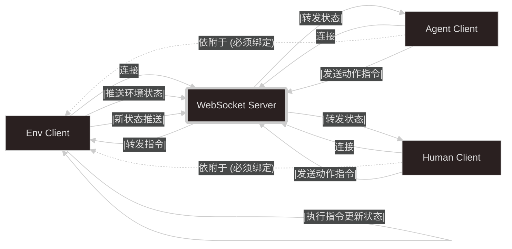

# WebSocket 连接图

```mermaid
---
config:
  theme: neo-dark
  layout: fixed
---
flowchart LR
    Env["Env Client"] -- 连接 --> Server["WebSocket Server"]
    Agent["Agent Client"] -- 连接 --> Server
    Human["Human Client"] -- 连接 --> Server
    Agent -. 依附于 (必须绑定) .-> Env
    Human -. 依附于 (必须绑定) .-> Env
    Env -- |推送环境状态| --> Server
    Server -- |转发状态| --> Agent & Human
    Agent -- |发送动作指令| --> Server
    Human -- |发送动作指令| --> Server
    Server -- |转发指令| --> Env
    Env -- |执行指令更新状态| --> Env
    Env -- |新状态推送| --> Server
    Server@{ shape: rounded}
    style Server stroke-width:4px,stroke-dasharray: 0
```